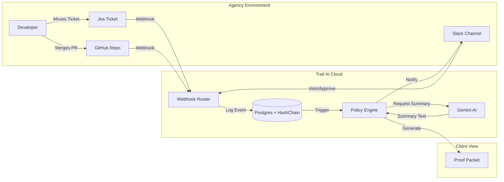

# Trail AI Architecture 🏗️

> **System Design, Data Flow, and Security Model.**

---

## 1. Core Principles
1.  **Metadata-First**: We process signals (PRs, Statuses), not source code.
2.  **Zero-Knowledge**: We cannot see, store, or leak user IP (Intellectual Property).
3.  **Tamper-Evident**: All events are hash-chained (`prevHash` -> `currHash`).
4.  **Optimistic Closure**: Assume success (CI Pass + Review), but allow human Veto.

---

## 2. System Diagram

---

## 3. Data Tech Stack

| Component | Technology | Role |
|-----------|------------|------|
| **Runtime** | Bun | High-performance JS runtime & package manager. |
| **API Framework** | Hono | Lightweight, Edge-ready web framework. |
| **Database** | Supabase (PostgreSQL) | Primary data store with RLS (future-proofing). |
| **ORM** | Drizzle | TypeScript-first schema definition & queries. |
| **Queue** | pg-boss | Job queue for "Optimistic Closure" timers (24h delays). |
| **AI** | Vertex AI (Gemini) | Summarization of PR titles/descriptions. |

---

## 4. Security Model

### Authentication
- **OAuth 2.0**: Used for all integrations (GitHub, Jira, Slack).
- **State**: `workspace_id` is passed as opaque state during OAuth flows to link accounts.

### Webhook Verification
- **GitHub**: `HMAC-SHA256` signature verification.
- **Slack**: `HMAC-SHA256` signing secret verification.
- **Jira**: Context verification (JWT/Connect - *planned*).
